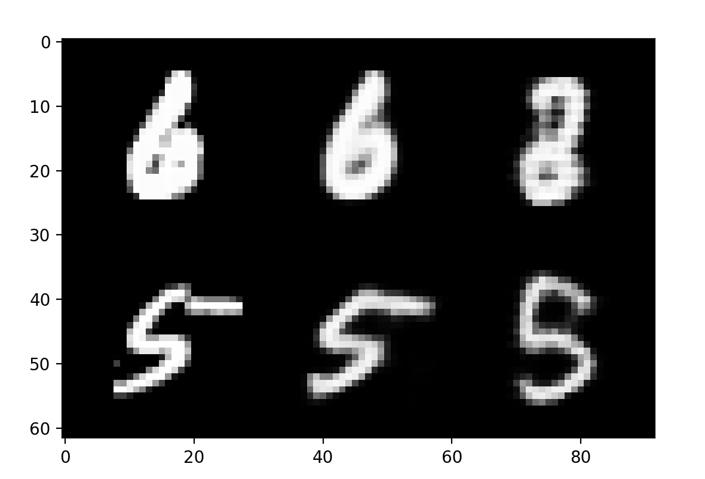
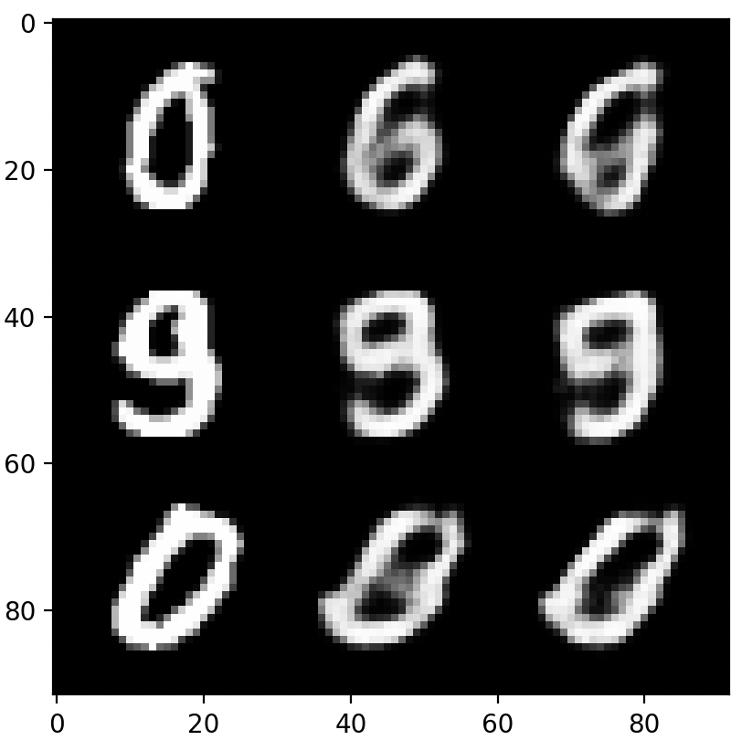

# Constructive Counterfactuals

Inspired by Zheng Dai's work with _Ablation Based Counterfactuals_ (https://arxiv.org/abs/2406.07908), this repository presents some experiments.
First, we aim to reproduce Dai and Glifford's results. A slightly different setup was used, with a VAE rather than a diffusion model. Furthermore, rather than ablating by removing a model from an ensemble where each model was trained on a subset, we instead ablate simply by zeroing the parameters strongly activated by a specific sample. (see [ablate.py](ablate.py))



The first column represents ground truth. The second column represents the VAE's reconstruction before ablation. The third column represents the reconstruction after ablation. Note that ablation was only applied to the first sample. While the first row shows the decrease in quality, the second row further proves that other training samples are unaffected.

---

I have reproduced the results presented in _Ablation Based Counterfactuals_ with a VAE and experimented with a new idea, called _Constructive Counterfactuals_. This method draws off of ABCs, but presents the reverse: Instead of ablating a model to prevent it from learning from a specific piece of data, using gradient-based methods to manipulate the parameters to allow a model to generalize from new data in a single step, _without retraining_. Preliminary results show that it's possible, at least for VAEs, to quickly generalize to a new form of data with a single reverse ablation step.

---

I started by gathering a subset of MNIST containing only 512 samples. Within this subset, I hid all samples of class 0 when training. The VAE trained successfully, struggling to reconstruct images of class 0 after training since they were excluded from the training data, as expected. Next, took a single sample and essentially applied ablation in reverse: updating the parameters based off of the sign of the gradient multiplied by a constant. This method is similar to both FGSM and a step in the traditional gradient descent algorithm. However, unlike gradient descent, we only do this for a single step.

```python
def reverse_ablate(image, net,strength=0.001):
    net.eval()
    net.zero_grad()

    loss = get_loss(image, net, mse_instead=USE_MSE_INSTEAD)
    loss.backward()

    with torch.no_grad():
        for param in net.parameters():
            if param.grad is not None:
                param.data = param - torch.sign(param.grad) * strength
```

Notably, this step not only decreases loss and improves reconstruction on the one sample, but the model is able to generalize to other samples.



The rows and columns follow the same conventions as the first figure. The third row now shows the increase in quality for samples of the same class that were _never shown to the model._ By reverse ablating just once with a single sample, the model was able to generalize and improve when given a similar task, while not degrading the rest of it.

---

All code is available in this repository, and model weights are located at runs/vae_l5_linear_512_no0/ckpt/best.pt.
Running `python constructive_counterfactuals.py` should work out-of-the-box if you have all of the proper requirements installed (Namely an updated installation of pytorch).
