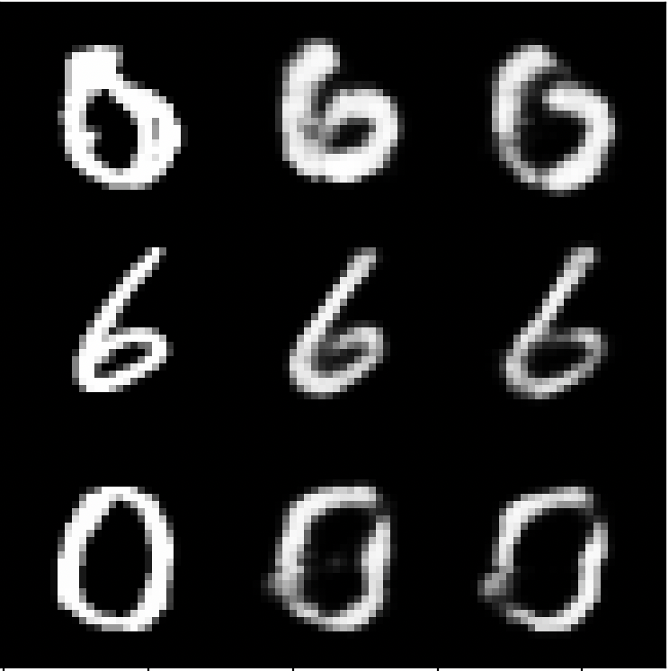

# Constructive Counterfactuals

### By Jacob Buckhouse

- [Part 1: Reproducing _Ablation Based Counterfactuals_](#part-1-reproducing-ablation-based-counterfactuals)

- [Part 2: Teaching an old model new tricks: _Constructive Counterfactuals_](#part-2-teaching-an-old-model-new-tricks-constructive-counterfactuals)

- [Part 3: Using Constructive Counterfactuals for Targeted Finetuning](#part-3-using-constructive-counterfactuals-for-targeted-finetuning)

### Part 1: Reproducing _Ablation Based Counterfactuals_

Inspired by Zheng Dai and David Glifford's work with _Ablation Based Counterfactuals_ ([arXiv:2406.07908v1](https://arxiv.org/abs/2406.07908)), this repository presents some experiments and expansions.
First, my aim was to reproduce their results. In order to encourage rapid experimentation and accessibility, I implemented the model as a VAE instead of a diffusion model. Additionally, rather than ablating by removing a model from an ensemble where each model was trained on a subset, I instead ablate simply by zeroing the parameters strongly activated by a specific sample: This allows these methods to be generalized to the most common architectures, rather than constructing an ensemble specifically for examining counterfactuals. (see [ablate.py](ablate.py) and [architecture.py](architecture.py))


The first column represents ground truth. The second column represents the VAE's reconstruction before ablation. The third column represents the reconstruction after ablation. Note that ablation was only applied to the first sample. While the first row shows the decrease in quality, the second row further proves that other training samples are unaffected.

Results:

- I was able to successfully reproduce Dai and Glifford's results in _Ablation Based Counterfactuals_, demonstrating that the process remains sound even with variation in architecture and exact implementation of the ablation.

---

### Part 2: Teaching an old model new tricks: _Constructive Counterfactuals_

Going further, I've begun experimenting with a new method, dubbed _Constructive Counterfactuals_. This method draws off of ABCs, but presents the reverse: Instead of ablating a model to prevent it from learning from a specific piece of data, we can add new data into a model _without retraining_ by using gradient-based methods to manipulate the parameters. Preliminary results show that it's possible, at least for VAEs, to quickly generalize to a new form of data with a single reverse ablation step.

---

I started by gathering a subset of MNIST containing only 512 samples. Within this subset, I hid all samples of class 0 when training. The VAE trained successfully, struggling to reconstruct images of class 0 after training since they were excluded from the training data, as expected. Next, took a single sample and essentially applied ablation in reverse: updating the parameters based off of the sign of the gradient multiplied by a constant. This method is similar to both FGSM and a step in the traditional gradient descent algorithm. However, unlike gradient descent, I only do this for a single step.

([constructive_counterfactuals.py](constructive_counterfactuals.py))

```python
def reverse_ablate(image, net,strength=0.001):
    net.eval()
    net.zero_grad()

    loss = get_loss(image, net, mse_instead=USE_MSE_INSTEAD)
    loss.backward()

    with torch.no_grad():
        for param in net.parameters():
            if param.grad is not None:
                param.data = param - torch.sign(param.grad) * strength
```

Notably, this step not only decreases loss and improves reconstruction on the one sample, but the model is able to generalize to other samples.


The rows and columns follow the same conventions as the first figure. The third row now shows the increase in quality for samples of the same class that were _never shown to the model._ By reverse ablating just once with a single sample, the model was able to generalize and improve when given a similar task, while not degrading the rest of it.

Results:

- Initial results are promising that you can add data in a single gradient step rather than retraining. Models fine-tuned in this way seem to generalize reasonably well after exposure to even one new sample.

---



Additional image.

---

### Part 3: Using Constructive Counterfactuals for Targeted Finetuning

Thank you to Zheng Dai for suggesting that I explore if Constructive Counterfactuals could be used to efficiently find good training sets to fine tune on.

Conventional finetuning works really well, but it's inefficient. You end up training more than you, with redundancies in the original training data.

Constructive Counterfactuals can be used to identify which samples are the most important for model finetuning, so that you can finetune at a fraction of the computational cost.

Unlike other finetuning methods like selective finetuning, which freeze certain weights in the model, using Constructive Counterfactuals for Targeted Finetuning works across the entire model but only trains from a subset of the most important finetuning data.

I implemented Constructive Counterfactuals for Targeted Finetuning by using the difference in reconstruction loss before and after reverse ablating as a heuristic for how easy it was for the model to learn from a given sample. From this, you can get the samples with a comparatively small loss difference: These were ones that the model had trouble learning from. The final step is to train on this smaller dataset, which allows for only the data that the model has not already learned from to be used, thus radically increasing efficiency.

This approach is more nuanced than Hard Example Mining because it selects samples that have a small loss difference after applying Constructive Counterfactuals, rather than just selecting samples with a higher loss.

In this case, I pretrained the VAE but initially excluded the digit 0 from the training set. Then, I used Targeted Finetuning to finetune on a subset of the new dataset (images of the digit 0)

Here's what I found:

```
Before finetuning
Avg Loss on Test Set (All digits): 0.02234510928246891
Avg Loss on Test Set (only 0): 0.0405641535835457

Selected 302 hard samples out of 512 for fine-tuning


Avg Loss on Test Set (All digits): 0.022237611338141505
Avg Loss on Test Set (only 0): 0.020719873944472056
```

Results:

- The model is able to learn from finetuned on data it hasn't seen before, improving its performance on new tasks without degrading its other knowledge. I posit that using Constructive Counterfactuals for Targeted Finetuning, we can finetune more efficiently by only using the most salient data.

([targeted_finetuning.py](targeted_finetuning.py))

Next, I improved upon this by adding FID between generated images and real images as a secondary metric. Here are the results:

```
Avg Loss on Test Set: 0.022117083728517173
FID on Test Set: 49.465606689453125
Avg Loss on Test (only 0) Set: 0.04029097671445925
FID on Test (only 0) Set: 90.47225952148438

Selected 287 hard samples for fine-tuning
After Fine-Tuning:
Avg Loss on Test Set: 0.022079628355868408
FID on Test Set: 46.07502746582031
Avg Loss on Test (only 0) Set: 0.020649259990022983
FID on Test (only 0) Set: 41.02202606201172

Finetuning on full dataset (512 samples)...
After Fine-Tuning on Full Dataset:
Avg Loss on Test Set: 0.022595768311020947
FID on Test Set: 48.40647888183594
Avg Loss on Test (only 0) Set: 0.0183276021052734
FID on Test (only 0) Set: 39.96887969970703
```

What's interesting is that this shows that using Constructive Counterfactuals for Targeted Finetuning not only significantly decreases FID on the new finetuning set (Test only 0. Drops from 90 to 41), but improvement is also seen on the previous dataset. In fact, the Targeted Finetuning shows greater retention of knowledge from the original dataset (46 vs. 48) without compromising FID on the new finetuning dataset (41 to 39). Furthermore, all of this is done with a fraction of the computing power, since only a subset of samples are selected for training with Targeted Finetuning.

Constructive Counterfactuals for Targeted Finetuning works for any situation in which the finetuning set is disjoint from the training set, but I could see it being particularly helpful for domain generalization with adaptation, in which it's advantageous to retain both the previous knowledge and the new fine-tuned data.

---

All code is available in this repository, and model weights are located at [runs/vae_l5_linear_512_no0/ckpt](runs/vae_l5_linear_512_no0/ckpt)

You should be able to reproduce my results by running `constructive_counterfactuals.py` or `targeted_finetuning.py`
